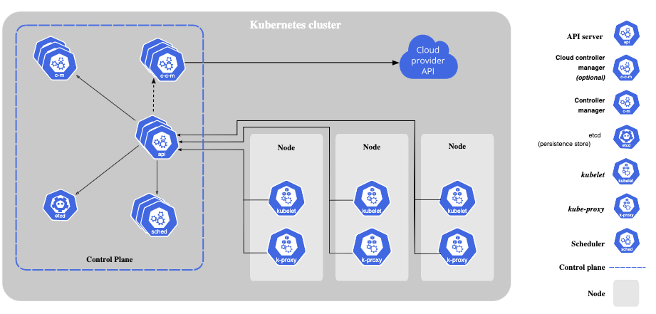

# k8s_workshop

### Table of Content
* [Overview](#overview)
  * [Pronunciation](#pronunciation)
  * [Why](#why)
  * [Why not](#why-not)
  * [Cluster components](#cluster-components)
  * [Objects](#objects)

* [Hands on](#hands-on)
  * [Prerequisites](#prerequisites)
  * [Deploy standalone resources with kubectl](#deploy-standalone-resources-with-kubectl)
  * [Deploy a chart](#deploy-a-chart)


## Overview
# Pronunciation
* Kubernetes meaning is captain in greek.
* The common pronunciation ku-br-neh-teez, but others may pronounce it differently, and in greek it will be with tes at the end.
* Abbreviated way is K8S (K-8letters-S).

# Why
* Do we know what containers are?
* orchestration engine/ system to help manage containers
  * Service discovery and load balancing
  * Rollout/Rollbacks with ease
  * Self healing features
  * Support batch executions (monitoring these not easy)
  * Plugable system
  * Scaling features
* Infrastructure abstrection

# Why not
* Complicated system
* overkill for small applications and small teams (today not as much)
* features do not come out of the box perfectly tailored and there is a lot of work to set the supportive systems to fit desire

# Cluster components
* Management Nodes
    * Will hold the control plane:
        * kube-api-server: API to interact with kubernetes
        * etcd: Distributed key-value store that holds the state
        * kube-controller-manager: Control loop that tracks at least one Kubernetes resource type. (there are many)
        * kube-scheduler: Watching for unassigned pods and select a node for them
        * cloud-controller-manager: Somewhat like the kube-controller but specifically to external cloud components.
* Worker Nodes
    * kubelet: agent that runs on each node, makes sure the containers are running in the pods, also makes sure they are healthy.
    * kube-proxy: agent that runs on each node, maintains network rules and allow network communication.
    * container runtime



* Flow:
    * apply a spec/ desired state
    * API validate and store it in etcd
    * A controller makes sure to meet the desired state in etcd
    * Scheduler makes sure to find a suitable node for the workload
    * kubelet makes sure it runs using the container runtime
    * kubelets updates the API with the status of the workload

# Objects
* pods: the smallest deployable unit, a group of one or more containers with shared resources (storage, network...)
* replicaset: a way to deploy multiple replicas of a pod
* deployment: higher level abstration that manages pods and replicasets and adds additional features for rolling updates and rollbacks
* daemonset: a way to make sure each node runs a copy of a pod.
* statefulset: a way to gaurentee ordering and uniqueness of pods with persistent identifier. usuallly for stateful applications.

# Networking
* service: exposing an application running as one or more pods.
    * clusterip
    * nodeport
    * loadbalancer
* ingress: maybe stop here

## Hands on
# Prerequisites
* Do we have a reachable k8s cluster?
* Make sure to have kubectl and helm installed.
```bash
# For mac users
brew install helm
brew install kubectl
```

# Deploy standalone resources with kubectl
* Create your own namespace
```bash
k8s_namespace=$(echo "$USER" | tr '[:upper:]' '[:lower:]')
kubectl create namespace "$k8s_namespace"
```

* Create an nginx deployment.
```bash
kubectl apply -f - <<EOF
apiVersion: apps/v1
kind: Deployment
metadata:
  name: nginx-deployment
  namespace: $k8s_namespace
  labels:
    app: nginx
spec:
  replicas: 2
  selector:
    matchLabels:
      app: nginx
  template:
    metadata:
      labels:
        app: nginx
    spec:
      containers:
      - name: nginx
        image: nginx
        resources:
          requests:
            memory: "0.5Gi"
            cpu: "0.5"
          limits:
            memory: "0.5Gi"
            cpu: "0.5"
EOF
```

* Create a service of type nodeport to expose the application:
```bash
kubectl apply -f - <<EOF
apiVersion: v1
kind: Service
metadata:
  name: nginx-service
  namespace: $k8s_namespace
  labels:
    app: nginx
spec:
  type: NodePort
  selector:
    app: nginx
  ports:
    - protocol: TCP
      port: 80
      targetPort: 80
EOF
```

* some commands to inspect and see the status
```bash
kubectl get node -o wide
kubectl -n $k8s_namespace get pods
kubectl get pods -l app=nginx -A
kubectl -n $k8s_namespace describe pod pod_name
kubectl -n $k8s_namespace get service
kubectl -n $k8s_namespace describe service nginx-service
```

* try to reach your nginx
* try to swap the nginx image with broken image (`image: nginx` -> `image: nginxbroken`) and see what happens
* delete the created components
```bash
kubectl -n $k8s_namespace delete deployment nginx-deployment
kubectl -n $k8s_namespace delete service nginx-service
```

# Deploy a chart
* lets do something similar just with helm
* Examine the chart (probes are set to make the app roll real slow)
* Change values if you want
```bash
helm_release_name="$k8s_namespace-sample"
helm -n $k8s_namespace upgrade -i "$helm_release_name" ./sample_app_chart
```

* change the color value and run the helm command
* watch the pods while they swap
```bash
kubectl -n $k8s_namespace get pods -o wide -w
```

* We can use the same kubectl commands to see what resources we deployed
* to remove the resources we can uninstall the release instead of each resource
```bash
helm -n $k8s_namespace ls
helm -n $k8s_namespace uninstall "$helm_release_name"
```
